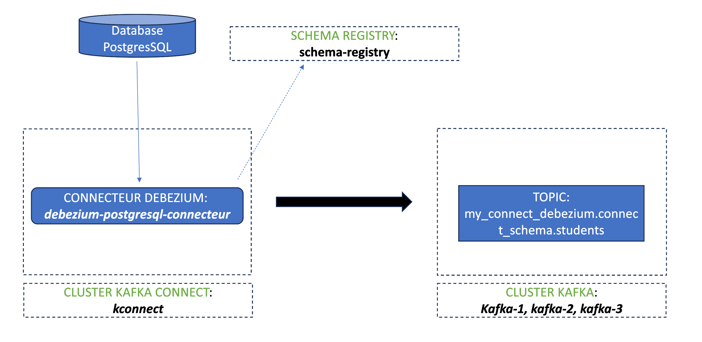

# MEDIUM <br />


## ObjectiVE
<p align="left"></p>
My project is as follows: deploy a debezium postgresql connector that will feed the connect_schema.students topic with data in avro format. In a second time I consume this data with an avro console consumer that will reference the schema registry.
For this I used the docker images: debezium/kafka:2.4, debezium/connect:2.5 and confluentinc/cp-schema-registry:7.5.3.

# Démo
- With Debezium recommandations
	- Push "debezium-connector-postgres" on kconnect

```
docker exec -it kconnect curl -s -XPOST -H "Content-Type: application/json; charset=UTF-8" http://localhost:8083/connectors/ -d '
{
    "name": "debezium-connector-postgres",
    "config": {
        "connector.class": "io.debezium.connector.postgresql.PostgresConnector",
        "database.hostname": "db",
        "database.port": "5432",
        "database.user": "postgres",
        "database.password": "postgres",
        "database.dbname" : "postgres",
        "database.whitelist": "connect_schema",
        "table.include.list": "connect_schema.students",
        "topic.prefix": "my_connect_debezium",
        "plugin.name": "pgoutput",
        "key.converter.schema.registry.url": "http://schema-registry:8081",
        "value.converter.schema.registry.url": "http://schema-registry:8081",
        "key.converter": "io.confluent.connect.avro.AvroConverter",
        "value.converter": "io.confluent.connect.avro.AvroConverter"
    }
}' | jq .
```
Result:
```
{
  "name": "debezium-connector-postgres",
  "config": {
    "connector.class": "io.debezium.connector.postgresql.PostgresConnector",
    "database.hostname": "db",
    "database.port": "5432",
    "database.user": "postgres",
    "database.password": "postgres",
    "database.dbname": "postgres",
    "database.whitelist": "connect_schema",
    "table.include.list": "connect_schema.students",
    "topic.prefix": "my_connect_debezium",
    "plugin.name": "pgoutput",
    "key.converter.schema.registry.url": "http://schema-registry:8081",
    "value.converter.schema.registry.url": "http://schema-registry:8081",
    "key.converter": "io.confluent.connect.avro.AvroConverter",
    "value.converter": "io.confluent.connect.avro.AvroConverter",
    "name": "debezium-connector-postgres"
  },
  "tasks": [],
  "type": "source"
}
```
I check the connector status:
```
docker exec -it kconnect curl -s localhost:8083/connectors/debezium-connector-postgres/status | jq .
```
Result:
```
{
  "name": "debezium-connector-postgres",
  "connector": {
    "state": "RUNNING",
    "worker_id": "172.18.0.7:8083"
  },
  "tasks": [
    {
      "id": 0,
      "state": "FAILED",
      "worker_id": "172.18.0.7:8083",
      "trace": "java.lang.NoClassDefFoundError: com/google/common/base/Ticker\n\tat io.confluent.kafka.schemaregistry.client.CachedSchemaRegistryClient.<init>(CachedSchemaRegistryClient.java:181)\n\tat io.confluent.kafka.schemaregistry.client.CachedSchemaRegistryClient.<init>(CachedSchemaRegistryClient.java:164)\n\tat io.confluent.kafka.schemaregistry.client.SchemaRegistryClientFactory.newClient(SchemaRegistryClientFactory.java:36)\n\tat io.confluent.connect.avro.AvroConverter.configure(AvroConverter.java:71)\n\tat org.apache.kafka.connect.runtime.isolation.Plugins.newConverter(Plugins.java:394)\n\tat org.apache.kafka.connect.runtime.Worker.startTask(Worker.java:631)\n\tat org.apache.kafka.connect.runtime.Worker.startSourceTask(Worker.java:559)\n\tat org.apache.kafka.connect.runtime.distributed.DistributedHerder.startTask(DistributedHerder.java:1902)\n\tat org.apache.kafka.connect.runtime.distributed.DistributedHerder.lambda$getTaskStartingCallable$35(DistributedHerder.java:1919)\n\tat java.base/java.util.concurrent.FutureTask.run(FutureTask.java:264)\n\tat java.base/java.util.concurrent.ThreadPoolExecutor.runWorker(ThreadPoolExecutor.java:1128)\n\tat java.base/java.util.concurrent.ThreadPoolExecutor$Worker.run(ThreadPoolExecutor.java:628)\n\tat java.base/java.lang.Thread.run(Thread.java:829)\nCaused by: java.lang.ClassNotFoundException: com.google.common.base.Ticker\n\tat java.base/java.net.URLClassLoader.findClass(URLClassLoader.java:476)\n\tat java.base/java.lang.ClassLoader.loadClass(ClassLoader.java:594)\n\tat org.apache.kafka.connect.runtime.isolation.PluginClassLoader.loadClass(PluginClassLoader.java:124)\n\tat java.base/java.lang.ClassLoader.loadClass(ClassLoader.java:527)\n\t... 13 more\n"
    }
  ],
  "type": "source"
}
```


* Solution

